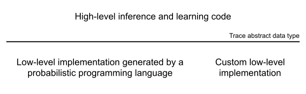

# What is OpenGen?
{: class="homepage"}

 

The goal of this site is to make **probabilistic modeling, inference, and learning** techniques accessible to a wider audience by 
listing a curated set of software tools and reusable modeling components 
that are based on a common set of design principles and interfaces.
These software de-emphasize the role of custom mathematical derivations in the use of state-of-the-art probabilistic modeling, inference, and learning techniques, and instead
encourage use of software engineering principles to simplify the implementation of these techniques.

One core design principle for these software is the **separation of concerns between the implementation of a probabilistic model and the implementation of inference and learning algorithms** that operate on the model.
This separation is based on an interface for models called the '**trace abstract data type**', which defines a set of core operations that are analogous to (and generalize) automatic differentiation as used in deep learning, but also support for incrementally optimizing and sampling hypotheses using model-based inference.
We call software that utilizes similar abstract data types to represent generative models as 'in the Gen paradigm'.

If a model is implemented in the Gen paradigm, then existing generic inference and learning algorithm implementations can be applied to it (reducing the amount of new code that has to be written),
and the model and the inference and learning algorithms can be modified more independently, allowing for more rapid experimentation.
Without this separation of concerns, it is easy to get stuck re-writing inference code from scratch when a changing the model.

The trace abstract data type is most closely aligned with **Monte Carlo** algorithms, but also supports **variational inference** algorithms, **deep learning** algorithms, and hybrid algorithms that combine all three inference and learning paradigms.
It is also compatible with symbolic inference algorithms.
An early version of this abstract data type is described in [this PhD thesis](https://www.mct.dev/assets/mct-thesis.pdf) and a 2019 PLDI paper ([paper](https://dl.acm.org/doi/10.1145/3314221.3314642), [bibtex](https://www.gen.dev/assets/gen-pldi.txt)).

**Probabilistic programming languages** can be used to automatically generate the implementation of the trace abstract data type from your declarative specification of the model.
You can also always implement the data type yourself for your model for more control and, usually, better performance, once it is time to optimize your implementation.

 

    

    

        
    

    

 

The core data type can also be implemented **compositionally**, which means that you can compose generaive models from smaller building blocks, which are themselves either implemented using a probabilistic programming language or by hand.
The compositionality of generative models in this paradigm makes it possible to develop reusable libraries of modeling components for different domains (see 'Domain-Specific Software', below).

While not every library listed on this site uses the same exact interface, the interfaces are similar to one another.
This means that after learning to write inference and learning code using one library, it should be relatively easy to pick up another library.

Probabilistic programming is a very active and still-early research field.
This site will aim to provide a vehicle for research projects that are compatible with the Gen paradigm to be adopted more widely as engineering tools.

# General-Purpose Software 
{: class="homepage"}

  <!---
  ***************
  **** Julia ****
  ***************
  -->
  

    

      <h5 class="mb-0">
        <button class="btn btn-link" data-toggle="collapse" data-target="#collapseJulia" aria-expanded="true" aria-controls="julia">
          <h4>Julia</h4>
        </button>
      </h5>
    

    

      

            <!-- Gen.jl -->
            

                

                    <h5 class="card-title">Gen.jl</h5>
                    

                        A general-purpose probabilistic programming system with programmable inference, embedded in Julia.
                    

                    <a href="https://gen.dev/" class="btn btn-primary">Web Site</a>
                    <a href="https://github.com/probcomp/Gen.jl" class="btn btn-primary">GitHub</a>
                    <a href="https://gen.dev/dev/" class="btn btn-primary">Documentation</a>
                    <a href="https://gen.dev/tutorials/" class="btn btn-primary">Tutorials</a>
                    <a href="https://gen.dev/ecosystem/" class="btn btn-primary">Ecosystem</a>
                

                

                    

                    
Supported

                

    

      

    

  

  <!---
  *************
  **** C++ ****
  *************
  -->
  

    

      <h5 class="mb-0">
        <button class="btn btn-link" data-toggle="collapse" data-target="#collapseCpp" aria-expanded="true" aria-controls="collapseCpp">
          <h4>C++</h4>
        </button>
      </h5>
    

    

      

    

        <h5 class="card-title">GenTL</h5>
        

            C++ template library for probabilistic inference and learning based on probabilistic programming
        

        <a href="https://github.com/OpenGen/GenTL" class="btn btn-primary">GitHub</a>
    

    

        

        
Under development

    

    

        <h5 class="card-title">GenTorch</h5>
        

            Work-in-progress C++/LibTorch-based Gen probabilistic programming language
        

        <a href="https://github.com/OpenGen/GenTorch" class="btn btn-primary">GitHub</a>
    

    

        
Compatible with <a href="#gentl">GenTL</a>

        
Under development

    

    

    

  

  <!---
  ****************
  **** Python ****
  ****************
  -->
  

    

      <h5 class="mb-0">
        <button class="btn btn-link" data-toggle="collapse" data-target="#collapsePython" aria-expanded="true" aria-controls="collapsePython">
          <h4>Python</h4>
        </button>
      </h5>
    

    

      

    

        <h5 class="card-title">PyGen</h5>
        

            A minimal Gen dynamic modeling language (DML) implementation in PyTorch
        

        <a href="https://github.com/OpenGen/pygen" class="btn btn-primary">GitHub</a>
    

    

        

        
Experimental

    

    

 <!-- general purpose software -->

# Domain-Specific Software 
{: class="homepage"}

  

    

      <h5 class="mb-0">
        <button class="btn btn-link" data-toggle="collapse" data-target="#collapseOne" aria-expanded="true" aria-controls="collapseOne">
          <h4>Time series modeling</h4>
        </button>
      </h5>
    

    

      

        Anim pariatur cliche reprehenderit, enim eiusmod high life accusamus terry richardson ad squid. 3 wolf moon officia aute, non cupidatat skateboard dolor brunch. Food truck quinoa nesciunt laborum eiusmod. Brunch 3 wolf moon tempor, sunt aliqua put a bird on it squid single-origin coffee nulla assumenda shoreditch et. Nihil anim keffiyeh helvetica, craft beer labore wes anderson cred nesciunt sapiente ea proident. Ad vegan excepteur butcher vice lomo. Leggings occaecat craft beer farm-to-table, raw denim aesthetic synth nesciunt you probably haven't heard of them accusamus labore sustainable VHS.
      

    

  

  

    

      <h5 class="mb-0">
        <button class="btn btn-link" data-toggle="collapse" data-target="#collapseTwo" aria-expanded="true" aria-controls="collapseTwo">
          <h4>3D perception</h4>
        </button>
      </h5>
    

    

      

    

        <h5 class="card-title">PyGen</h5>
        

            A minimal Gen dynamic modeling language (DML) implementation in PyTorch
        

        <a href="https://github.com/OpenGen/pygen" class="btn btn-primary">GitHub</a>
    

    

        Experimental
    

    

        Compatible with <a href="#genjl">Gen.jl</a>
    

    

        <h5 class="card-title">PyGen</h5>
        

            A minimal Gen dynamic modeling language (DML) implementation in PyTorch
        

        <a href="https://github.com/OpenGen/pygen" class="btn btn-primary">GitHub</a>
    

    

        Experimental
    

 
